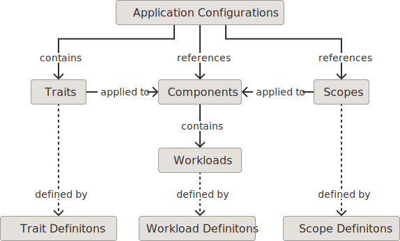
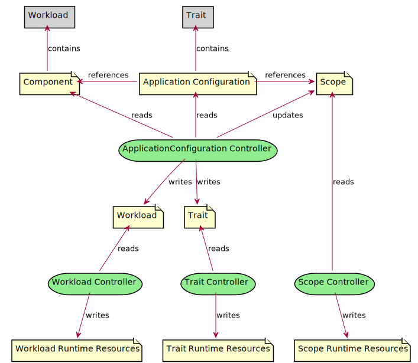
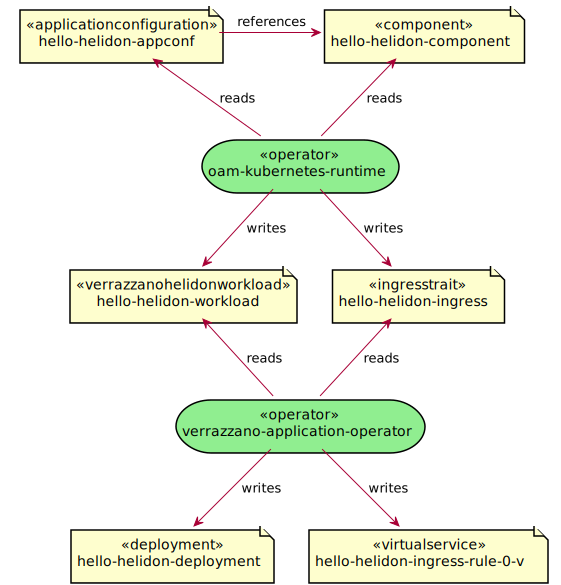

Verrazzano uses the [Open Application Model](https://oam.dev/) (OAM) specification to provide a layered approach to describing and deploying applications.
OAM is a specification developed within the [Cloud Native Computing Foundation](https://www.cncf.io/) (CNCF).
Verrazzano is compliant with the [OAM specification version 0.2.1](https://github.com/oam-dev/spec/tree/v0.2.1).

An ApplicationConfiguration is a composition of Components.
Components encapsulate application implementation details.
Application deployers apply Traits and Scopes to customize the Components for the environment.

The OAM specification supports extensibility.
The behavior of the platform can be extended by adding OAM compliant definitions and controllers.
Specifically, new workload, Trait, and Scope definitions can be added.
These definitions can be referenced by Components and application configurations and are processed by custom controllers.



## Application configurations
An ApplicationConfiguration is a collection of references to Components.
A set of Traits and Scopes can be applied to each Component reference.
The platform uses these Components, Traits, and Scopes to generate the final application
resources during deployment.

The following sample shows the high level structure of an ApplicationConfiguration.


```yaml
apiVersion: core.oam.dev/v1alpha2
kind: ApplicationConfiguration
...
spec:
  components:
    - componentName: example-component-1
      traits:
        ...
      scopes:
        ...
    - componentName: example-component-2
        ...
```



### Components
A Component wraps the content of a workload.
The platform extracts the workload during deployment and creates new resources that result from the application of Traits and Scopes.
Verrazzano and the OAM specification provide several workloads, for example VerrazzanoHelidonWorkload and ContainerizedWorkload.
The workloads also can be any Kubernetes resource.
For some Kubernetes resources, the `oam-kubernetes-runtime` operator may need to be granted additional permission.

A Component can also be parameterized; this allows the workload content to be customized when referenced within an ApplicationConfiguration.
See the [OAM specification](https://github.com/oam-dev/spec/blob/v0.2.1/4.component.md#spec) for details.

The following sample shows the high level structure of a Component.


```yaml
apiVersion: core.oam.dev/v1alpha2
kind: Component
...
spec:
  workload:
    ...
  parameters:
    ...
```


### Workloads
Components contain an embedded workload.
Verrazzano and the OAM specification provide several workloads, for example VerrazzanoWebLogicWorkload and ContainerizedWorkload.
Workloads can also be any Kubernetes resource.

The following sample shows a VerrazzanoHelidonWorkload workload embedded within a Component.


```yaml
apiVersion: core.oam.dev/v1alpha2
kind: Component
...
spec:
  workload:
    apiVersion: oam.verrazzano.io/v1alpha1
    kind: VerrazzanoHelidonWorkload
    spec:
      deploymentTemplate:
        podSpec:
          containers:
            - name: example-container
              image: ...
              ...
```


A workload can optionally have an associated WorkloadDefinition.
This provides the platform with information about the schema of the workload.
A WorkloadDefintion is typically provided by the platform, not an end user.

### Traits
Traits customize Component workloads and generate related resources during deployment.
Verrazzano provides several Traits, for example IngressTrait and MetricsTrait.
The platform extracts Traits contained within an ApplicationConfiguration during deployment.
This processing is similar to the extraction of workload content from Component resources.
Note that for some Kubernetes resources, the `oam-kubernetes-runtime` operator may need to be granted `create` permission.

A Kubernetes operator, for example `verrazzano-application-operator`, processes these extracted Traits and may create additional related resources or may alter related workloads.
Each Trait implementation will behave differently.

The following sample shows an IngressTrait applied to a referenced Component.


```yaml
apiVersion: core.oam.dev/v1alpha2
kind: ApplicationConfiguration
...
spec:
  components:
    - componentName: example-component
      traits:
        - trait:
            apiVersion: oam.verrazzano.io/v1alpha1
            kind: IngressTrait
            spec:
              rules:
                - paths:
                    - path: "/greet"
```


Each Trait type optionally can have an associated TraitDefinition.
This provides the platform with additional information about the Trait's schema and workloads to which the Trait can be applied.
A TraitDefintion is typically provided by the platform, not an end user.

### Scopes
Scopes customize Component workloads and generate related resources during deployment.
An ApplicationConfiguration contains Scope references instead of the Scope's content being embedded.
The platform will update the Scopes with a reference to each applied Component.
This update triggers the related operator to process the Scope.

The following sample shows a reference to a HealthScope named `example-health-scope`.

```yaml
apiVersion: core.oam.dev/v1alpha2
kind: ApplicationConfiguration
...
spec:
  components:
    - componentName: example-component
      scopes:
        - scopeRef:
            apiVersion: core.oam.dev/v1alpha2
            kind: HealthScope
            name: example-health-scope
        ...
```


The following sample shows the configuration details of the referenced HealthScope.


```yaml
apiVersion: core.oam.dev/v1alpha2
kind: HealthScope
metadata:
  name: example-health-scope
spec:
  probe-method: GET
  probe-endpoint: /health
```


Each Scope type can optionally have an associated ScopeDefinition.
This provides the platform with additional information about processing the Scope:
- The Scope's schema
- The workload types to which the Scope can be applied
- The field within the Scope used to record related Component references

A ScopeDefintion is typically provided by the platform, not an end user.

## Verrazzano workloads
The Verrazzano platform provides several workload definitions and implementations:

- The VerrazzanoWebLogicWorkload is used for WebLogic workloads. See [WebLogic Workload]().
- The VerrazzanoCoherenceWorkload is used for Coherence workloads. See [Coherence Workload]().
- The VerrazzanoHelidonWorkload is used for Helidon workloads. See [Helidon Workload]().


### OAM ContainerizedWorkload
The ContainerizedWorkload should be used for long-running container workloads which are not covered by the workload types described previously.
This workload type is similar to the Deployment workload.
It is provided to ensure that OAM can be used for non-Kubernetes deployment environments.
See the [OAM specification](https://github.com/oam-dev/spec/blob/v0.2.1/core/workloads/containerized_workload/containerized_workload.md).

## Verrazzano Traits
The Verrazzano platform provides several Trait definitions and implementations:

- [IngressTrait]()
- [MetricsTrait]()
- [LoggingTrait]()

## Kubernetes resources
Verrazzano and OAM provide workloads and Traits to define and customize applications.
However, some situations may require resources beyond those provided.
In this case, other existing Kubernetes resources can also be used.
The `todo-list` example takes advantage of this capability in several Components to support unique Service and ConfigMap requirements.

Most Kubernetes resources can be embedded as a workload within a Component.
The following sample shows how a Deployment can be embedded as a workload within a Component.
The `oam-kubernetes-runtime` operator will process the Component and extract the Deployment to a separate resource during deployment.


```yaml
apiVersion: core.oam.dev/v1alpha2
kind: Component
...
spec:
  workload:
    kind: Deployment
    apiVersion: apps/v1
    name: ...
    spec:
      selector:
        ...
      template:
        ...
```


Most Kubernetes resources can also be embedded as a Trait within an ApplicationConfiguration.
The following sample shows how an Ingress can be embedded as a Trait within an ApplicationConfiguration.
The `oam-kubernetes-runtime` operator will process the ApplicationConfiguration and extract the Ingress to a separate resource during deployment.
In the following sample, note that the Ingress is the Kubernetes Ingress, not the IngressTrait provided by Verrazzano.


```yaml
apiVersion: core.oam.dev/v1alpha2
kind: ApplicationConfiguration
...
spec:
  components:
    - componentName: ...
      traits:
        - trait:
            apiVersion: networking.k8s.io/v1beta1
            kind: Ingress
            ...
            spec:
              rules:
                ...
```

The `oam-kubernetes-runtime` operator has the following limited set of cluster role privileges by default.

| API Groups | Resources | Verbs |
| --- | --- | --- |
| | `configmaps`, `events`, `services` | `create`, `delete`, `deletecollection`, `get`, `list`, `patch`, `update`, `watch` |
| | `persistentvolumeclaims` |  `create`, `delete`, `deletecollection`, `get`, `list`, `patch`, `update` |
| `apps` | `deployments`, `controllerrevisions` |  `create`, `delete`, `deletecollection`, `get`, `list`, `patch`, `update`, `watch` |
| `core.oam.dev` | `*` |  `create`, `delete`, `deletecollection`, `get`, `list`, `patch`, `update`, `watch` |
| `oam.verrazzano.io` | `*` |  `create`, `delete`, `deletecollection`, `get`, `list`, `patch`, `update`, `watch` |

Your cluster administrator may need to grant the `oam-kubernetes-runtime` operator additional privileges to enable the use of some Kubernetes resources as workloads or Traits.
Create additional roles and role bindings for the specific resources to be embedded as workloads or Traits.
The following examples of ClusterRole and ClusterRoleBinding show how `oam-kubernetes-runtime` can be granted privileges to manage Ingress resources.


```yaml
apiVersion: rbac.authorization.k8s.io/v1
kind: ClusterRole
metadata:
  name: oam-kubernetes-runtime-ingresses
rules:
  - apiGroups:
    - networking.k8s.io
    - extensions
    resources:
    - ingresses
    verbs:
    - create
    - delete
    - get
    - list
    - patch
    - update
```





```yaml
apiVersion: rbac.authorization.k8s.io/v1
kind: ClusterRoleBinding
metadata:
  name: oam-kubernetes-runtime-ingresses
roleRef:
  apiGroup: rbac.authorization.k8s.io
  kind: ClusterRole
  name: oam-kubernetes-runtime-ingresses
subjects:
  - kind: ServiceAccount
    name: oam-kubernetes-runtime
    namespace: verrazzano-system
```


## Deployment
An application deployment occurs in Verrazzano through a number of Kubernetes controllers, reading and writing various resources.
Each controller processes application resources, and generates or updates other related resources.
Different types of controllers process different levels of application resources.

The ApplicationConfiguration controller processes ApplicationConfiguration and Component resources.
This controller extracts and stores a workload for each Component referenced within ApplicationConfiguration resources.
Verrazzano implements the ApplicationConfiguration controller within the `oam-kubernetes-runtime` operator.
Similarly, the ApplicationConfiguration controller extracts and stores Trait resources associated with Component resources in the ApplicationConfiguration.

The workload controllers process workload resources created by the ApplicationConfiguration controller, for example ContainerizedWorkload or VerrazzanoWebLogicWorkload.
This controller processes these workload resources and generates more specific runtime resources.
For example, the ContainerizedWorkload controller processes a ContainerizedWorkload resource and generates a Deployment resource.
The VerrazzanoWebLogicWorkload controller processes a VerrazzanoWebLogicWorkload resource and generates a Domain resource.
These controllers may take into account Traits and Scopes that are applied to the workload's Component references within the ApplicationConfiguration.
Verrazzano implements these workload controllers in two operators.
Verrazzano specific workloads, for example VerrazzanoHelidonWorkload, are processed by a controller within the `verrazzano-application-operator`.
Workloads defined by OAM, for example ContainerizedWorkload, are processed by a controller with the `oam-kubernetes-runtime` operator.

The Trait controllers process Trait resources created by the ApplicationConfiguration controller, for example MetricsTrait.
The ApplicationConfiguration controller records the Component to which it was applied within each extracted Trait.
The Trait controllers process extracted Trait resources, and generate or update other related resources.
For example, the IngressTrait controller within the `verrazzano-application-operator` processes IngressTrait resources and generates related Gateway and VirtualService resources.
The same operator contains a MetricsTrait controller which processes MetricsTrait resources and adds annotations to related resources such as Deployments.

Scope controllers read Scope resources updated by the ApplicationConfiguration controller during deployment.
The ApplicationConfiguration controller updates the Scope resources with references to each Component to which the Scope is applied.

The following diagram shows the relationships between the resources and controllers described previously.


The following diagram, based on the `hello-helidon` example, shows the processing of resources from a Kubernetes operator perspective.
Controllers within the `oam-kubernetes-runtime` process the ApplicationConfiguration and Component resources and generate VerrazzanoHelidonWorkload and IngressTrait.
Then controllers within the `verrazzano-application-operator` process the VerrazzanoHelidonWorkload and IngressTrait resources to generate Deployment, VirtualService, and other resources.


