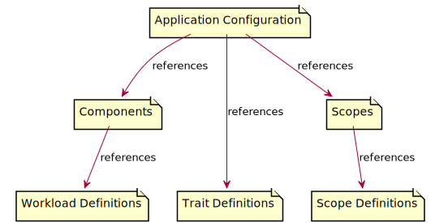

Verrazzano 
## OAM Introduction

- Goals
  - Application Centric - The OAM specification provides a layered approach to describing and deploying applications.
    Applications are logical compositions of Components.
    Components encapsulate implementation details.
    Traits and scopes tailor the application for the specific execution environment.
  - Extensible - The OAM specification supports platform extensibility by design.
    The behavior of the platform can be extended by through the addition of definitions and controllers.
    Specifically new workload, trait and scope definitions can be added.
    These definitions can be referenced by components and application configurations and processed by custom controllers.
- Specification
  - The [Open Application Model](https://oam.dev/) (OAM) is a specification developed within the [Cloud Native Computing Foundation](https://www.cncf.io/) (CNCF) 
    - Verrazzano is compliant with version [v0.2.1](https://github.com/oam-dev/spec/tree/v0.2.1) of the OAM specification.
- Extensions
  - WebLogic
  - Coherence
  - Helidon
  - Observability

## OAM Architecture
- Diagram
  - 
  - 
- Workload
- Component
- ApplicationConfiguration
- Trait
- Scope
- Personas
  - Platform Provider - The platform provider is responsible for providing and managing the Kubernetes cluster and the Verrazzano platform. 
    The platform provider is responsible for the default set of workload, trait and scope definitions. 
  - Component Provider - The component provider is responsible for providing the components that will be assembled into applications.
    Component provider may or may not be the same individuals as application providers.
  - Application Provider - The application provider is responsible for assembling the available components, traits and scopes into a deployable application.

## Workloads
- VerrazzanoWeblogicWorkload
- VerrazzanoCohereneceWorkload
- VerrazzanoHelidonWorkload
- OAM ContainerizedWorkload
- Standard Kubernetes Workloads

## Traits & Scopes
- IngressTrait
- MetricsTrait

## Troubleshooting
### Application deployment failures
During application deployment the oam-kubernetes-runtime abd verrazzano-application-operator cooperate through the generation and update of resources.
The oam-kubernetes-runtime processes the ApplicationConfiguration and Component resources provided by the user and generates workload and trait instance resources.
The verrazzano-application-operator processes Verrazzano specific workload and trait instance resources and generates lower level resources.

Troubleshooting application deployments should follow three general steps.
1. Review the status of the oam-kubernetes-runtime and verrazzano-application-operator operator pods.
2. Review the logs of the oam-kubernetes-runtime and verrazzano-application-operator operator pods.
3. Review the resources generated by the oam-kubernetes-runtime and the verrazzano-application-operator.

#### Review oam-kubernetes-runtime operator status
The oam-kubernetes-runtime pod must have a status of `Running` in order for application deployment to succeed.
The command to get the pod status is below.
```shell
kubectl get pods -n verrazzano-system -l app.kubernetes.io/name=oam-kubernetes-runtime
```
If the pod status is not `Running`, see the instructions below for reviewing the oam-kubernetes-runtime pod logs.  

#### Review verrazzano-application-operator operator status
The verrazzano-application-operator pod must have a status of `Running` in order for application deployment to succeed.
The command to get the pod status is below.
```shell
kubectl get pods -n verrazzano-system -l app=verrazzano-application-operator
```
If the pod status is not `Running`, see the instructions below for reviewing the verrazzano-application-operator logs.

#### Review oam-kubernetes-runtime operator logs
Review the oam-kubernetes-runtime pod logs for any indication that pod startup or the generation of workload or trait instances has failed.
The command to get the logs is below.
```shell
kubectl logs -n verrazzano-system -l app.kubernetes.io/name=oam-kubernetes-runtime
```

#### Review verrazzano-application-operator logs
Review the verrazzano-application-operator logs for any indication that pod startup or the generation of resources has failed.
The command to get the logs is below.
```shell
kubectl logs -n verrazzano-system -l app=verrazzano-application-operator
```

#### Review generated workload instance resources
```shell
kubectl get -n hello-helidon verrazzanohelidonworkload hello-helidon-workload
kubectl get -n hello-helidon deployment hello-helidon-deployment
kubectl get -n hello-helidon service hello-helidon-deployment
```

#### Review generated trait instances resources
```shell
kubectl get -n hello-helidon ingresstrait hello-helidon-ingress
kubectl get -n istio-system Certificate hello-helidon-hello-helidon-appconf-cert
kubectl get -n hello-helidon gateway hello-helidon-hello-helidon-appconf-gw
kubectl get -n hello-helidon virtualservice hello-helidon-ingress-rule-0-vs
```

#### Check for RBAC privilege issues
```shell
kubectl logs -n verrazzano-system -l app.kubernetes.io/name=oam-kubernetes-runtime | grep forbidden
```


Standard Kubernetes Resources
```shell
kubectl create namespace oam-kube
kubectl label namespace oam-kube verrazzano-managed=true istio-injection=enabled
# Temporary fix to allow oam-kubernetes-runtime to create arbitrary resources
# Need to evaluate if ever allowing this is acceptable as it may allow anyone that can create
# a component and/or applicationconfiguration to create arbitrary resources, 
kubectl create clusterrolebinding oam-kubernetes-runtime-cluster-admin --clusterrole=cluster-admin --serviceaccount=verrazzano-system:oam-kubernetes-runtime

kubectl apply -f - <<EOF
apiVersion: core.oam.dev/v1alpha2
kind: Component
metadata:
  name: oam-kube-dep-comp
  namespace: oam-kube
spec:
  workload:
    kind: Deployment
    apiVersion: apps/v1
    name: oam-kube-dep
    spec:
      replicas: 1
      selector:
        matchLabels:
          app: oam-kube-app
      template:
        metadata:
          labels:
            app: oam-kube-app
        spec:
          containers:
            - name: oam-kube-cnt
              image: hashicorp/http-echo
              args:
                - "-text=hello"
EOF

kubectl apply -f - <<EOF
apiVersion: core.oam.dev/v1alpha2
kind: Component
metadata:
  name: oam-kube-svc-comp
  namespace: oam-kube
spec:
  workload:
    kind: Service
    apiVersion: v1
    metadata:
      name: oam-kube-svc
    spec:
      selector:
        app: oam-kube-app
      ports:
      - port: 5678 # Default port for image
EOF

kubectl apply -f - <<EOF
apiVersion: core.oam.dev/v1alpha2
kind: ApplicationConfiguration
metadata:
  name: oam-kube-appconf
  namespace: oam-kube
spec:
  components:
    - componentName: oam-kube-dep-comp
    - componentName: oam-kube-svc-comp
      traits:
        - trait:
            apiVersion: networking.k8s.io/v1beta1
            kind: Ingress
            metadata:
              name: oam-kube-ing
              annotations:
                kubernetes.io/ingress.class: istio
            spec:
              rules:
              - host: oam-kube-app.example.com
                http:
                  paths:
                    - path: /example
                      backend:
                        serviceName: oam-kube-svc
                        servicePort: 5678
EOF

export INGRESS_HOST=$(kubectl -n istio-system get service istio-ingressgateway -o jsonpath='{.status.loadBalancer.ingress[0].ip}') ; printf "INGRESS_HOST=${INGRESS_HOST}\n"
curl -H'Host:oam-kube-app.example.com' http://${INGRESS_HOST}/example

kuberctl delete namespace oam-kube
```