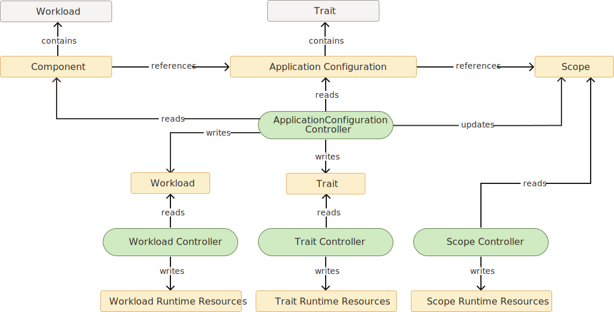

### Overview
Verrazzano utilizes The OAM specification to provide a layered approach to describing and deploying applications.
The [Open Application Model](https://oam.dev/) (OAM) is a specification being developed within the [Cloud Native Computing Foundation](https://www.cncf.io/) (CNCF).
Verrazzano is compliant with the [OAM specification version 0.2.1](https://github.com/oam-dev/spec/tree/v0.2.1).

Application Configurations are logical compositions of Components.
Components encapsulate and abstract application implementation details.
Application deployers apply Traits and Scopes to Components to tailor them to the environment.

The OAM specification supports extensibility by design.
The behavior of the platform can be extended by through the addition of definitions and controllers.
Specifically new workload, trait and scope definitions can be added.
These definitions can be referenced by components and application configurations and are processed by custom controllers.

Verrazzano takes advantage of this extensibility to add several capabilities.
- WebLogic workload support
- Coherence workload support
- Helidon workload support
- Observability support
- Ingress support

### Applications


#### Workload
TODO

#### Component
TODO

#### ApplicationConfiguration
TODO

#### Trait
TODO

#### Scope
TODO

### Verrazzano Workloads
TODO

#### VerrazzanoWeblogicWorkload
TODO

#### VerrazzanoCohereneceWorkload
TODO

#### VerrazzanoHelidonWorkload
TODO

#### OAM ContainerizedWorkload
TODO

### Verrazzano Traits
TODO

#### IngressTrait
TODO

#### MetricsTrait
TODO

### Kubernetes Resources
Verrazzano and OAM provide custom resources to define and customize applications.
However, some situations may require application resources beyond those provided.
In this case other existing Kubernetes resources can be used within the applications.
The todo-list example takes advantage of this capability in several Components to support unique Service and ConfigMap requirements. 

```yaml
apiVersion: core.oam.dev/v1alpha2
kind: Component
...
spec:
  workload:
    kind: Deployment
    apiVersion: apps/v1
    name: ...
    spec:
      selector:
        ...
      template:
        ...
```

```yaml
apiVersion: core.oam.dev/v1alpha2
kind: ApplicationConfiguration
...
spec:
  components:
    - componentName: ...
      traits:
        - trait:
            apiVersion: networking.k8s.io/v1beta1
            kind: Ingress
            ...
            spec:
              rules:
                ...
```

```yaml
kubectl apply -f - <<EOF
apiVersion: rbac.authorization.k8s.io/v1
kind: ClusterRole
metadata:
  name: oam-kubernetes-runtime-ingresses
rules:
  - apiGroups:
    - networking.k8s.io
    - extensions
    resources:
    - ingresses
    verbs:
    - "*"
```

```yaml
apiVersion: rbac.authorization.k8s.io/v1
kind: ClusterRoleBinding
metadata:
  name: oam-kubernetes-runtime-ingresses
roleRef:
  apiGroup: rbac.authorization.k8s.io
  kind: ClusterRole
  name: oam-kubernetes-runtime-ingresses
subjects:
  - kind: ServiceAccount
    name: oam-kubernetes-runtime
    namespace: verrazzano-system
```

### Deployment
An application deployment occurs in Verrazzano through a number of Kubernetes controllers reading and writing various resources. 
Each controller processes application resources and generates or updates other related resources.
Different types of controllers process different levels of application resources.

The ApplicationConfiguration controller processes ApplicationConfiguration and Component resources.
This controller extracts and stores workload for each Component referenced within ApplicationConfigurations.
Verrazzano implements the ApplicationConfiguration controller within the oam-kubernetes-runtime operator.
Similarly, the ApplicationConfiguration controller extracts and stores Traits associated with Components in the ApplicationConfiguration. 

The workload controllers processes workload resources created by the ApplicationConfiguration controller, for example ContainerizedWorkload or VerrazzanoWebLogicWorkload.
This controller processes these workload resources and generates more specific runtime resources.
For example the ContainerizedWorkload controller processes a ContainerizedWorkload resource and generates a Deployment resource.
The VerrazzanoWebLogicWorkload controller processes a VerrazzanoWebLogicWorkload resource and generates a Domain resource.
These controllers may take into account traits and scopes that are applied to the workload's Components within the ApplicationConfiguration.
Verrazzano implements these workload controllers in two operators.
Verrazzano specific workloads, for example VerrazzanoHelidonWorkload, are processed by a controller with the verrazzano-application-operator.
Workloads defined by OAM, for example ContainerizedWorkload, are processed by a controller with the oam-kubernetes-runtime operator.

The trait controllers process trait resources created by the ApplicationConfiguration controller, for example MatricsTrait.
The ApplicationConfiguration controller records in each generated trait the Component to which it was applied.
The trait controllers processes trait resources and generate or update other related resources.
For example the IngressTrait controller with the verrazzano-application-operator processes IngressTrait resources and generates related Gateway and VirtualService resources.
The same operator contains a MetricsTrait controller which processes MetricsTrait resources and adds annotations to related resources such as Deployments.

Scope controllers read scope resources updated by the ApplicationConfiguration controller.
The ApplicationConfiguration controller updates the scope resources with links to each Component to which the scope is applied.



The diagram below, based on the hello-helidon example, shows the processing of resources from a Kubernetes operator perspective.
Controllers within the oam-kubernetes-runtime process the ApplicationConfiguration and Component resources and generates VerrazzanoHelidonWorkload and IngressTrait. 
Controllers within the verrazzano-application-operator then process the VerrazzanoHelidonWorkload and IngressTrait resources to generates Deployment, VirtualService and other resources. 

