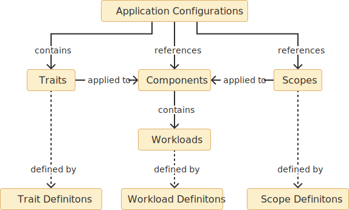
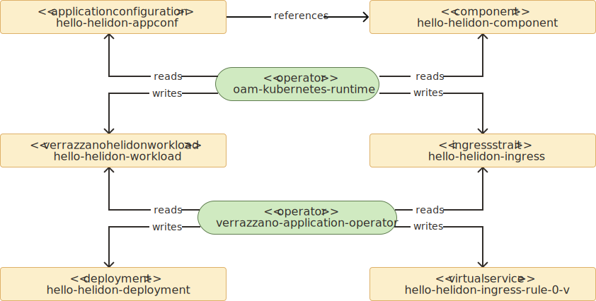

## Overview
Verrazzano utilizes The OAM specification to provide a layered approach to describing and deploying applications.
The [Open Application Model](https://oam.dev/) (OAM) is a specification developed within the [Cloud Native Computing Foundation](https://www.cncf.io/) (CNCF).
Verrazzano is compliant with the [OAM specification version 0.2.1](https://github.com/oam-dev/spec/tree/v0.2.1).

An Application Configuration is a composition of Components.
Components encapsulate application implementation details.
Application deployers apply Traits and Scopes to customize the Components for the environment.

The OAM specification supports extensibility by design.
The behavior of the platform can be extended by adding definitions and controllers.
Specifically new workload, trait and scope definitions can be added.
These definitions can be referenced by components and application configurations and are processed by custom controllers.



## ApplicationConfigurations
An `ApplicationConfiguration` is a collection of references to `Components`.
A set of `Traits` and `Scopes` can be applied to each `Component` reference.
The platform uses these `Components`, `Traits` and `Scopes` to generate the final application
resources during deployment.
```yaml
apiVersion: core.oam.dev/v1alpha2
kind: ApplicationConfiguration
...
spec:
  components:
    - componentName: example-component-1
      traits:
        ...
      scopes: 
        ...
    - componentName: example-component-2
        ...
```

### Components
A `Component` wraps the content of a workload.
The platform extracts the workload during deployment and creates new resources that result from the application of `Traits` and `Scopes`. 
Verrazzano and the OAM specification provide several workloads, for example `VerrazzanoHelidonWorkload` and `ContainerizedWorkload`.
The workloads can also be any Kubernetes resource.
Note that for some Kubernetes resource the `oam-kubernetes-runtime` operator may need to be granted create permission. 

A `Component` can also be parameterized.
This allows for the workload content to be customized when referenced within an `ApplicationConfiguration`.
See the [OAM specification](https://github.com/oam-dev/spec/blob/v0.2.1/4.component.md#spec) for details.
```yaml
apiVersion: core.oam.dev/v1alpha2
kind: Component
...
spec:
  workload:
    ...
  parameters:
    ...
```

### Workloads
`Components` contain an embedded workload.
Verrazzano and the OAM specification provide several workloads, for example `VerrazzanoWebLogicWorkload` and `ContainerizedWorkload`.
Workloads can also be any Kubernetes resource.

The example below shows an `VerrazzanoHelidonWorkload` workload embedded within a `Component`.
```yaml
apiVersion: core.oam.dev/v1alpha2
kind: Component
...
spec:
  workload:
    apiVersion: oam.verrazzano.io/v1alpha1
    kind: VerrazzanoHelidonWorkload
    spec:
      deploymentTemplate:
        podSpec:
          containers:
            - name: example-container
              image: ...
              ...
```

A workload can optionally have an associated `WorkloadDefinition`.
This provides the platform with information about the schema of the workload.
A `WorkloadDefintion` is typically provided by the platform not an end user.

### Traits
Traits customize component workloads during deployment.
Verrazzano provides several traits, for example `IngressTrait` and `MetricsTrait`.
The platform extracts traits contained within an `ApplicationConfiguration` during deployment.
This processing is similar to the extraction of `workload` content from `Component` resources.
Note that for some Kubernetes resources the oam-kubernetes-runtime operator may need to be granted create permission.

A Kubernetes operator, for example `verrazzano-application-operator`, processes these extracted `traits` and may create additional related resources or may alter related workloads.
```yaml
apiVersion: core.oam.dev/v1alpha2
kind: ApplicationConfiguration
...
spec:
  components:
    - componentName: example-component
      traits:
        - trait:
            apiVersion: oam.verrazzano.io/v1alpha1
            kind: IngressTrait
            spec:
              rules:
                - paths:
                    - path: "/greet"
                      ...
```

Each trait type can optionally have an associated `TraitDefinition`.
This provides the platform with additional information about the trait's schema the workloads to which the trait can be applied.
A `TraitDefintion` is typically provided by the platform not an end user.

### Scopes
TODO
```yaml
apiVersion: core.oam.dev/v1alpha2
kind: ApplicationConfiguration
...
spec:
  components:
    - componentName: example-component
      scopes:
        - scopeRef:
            apiVersion: core.oam.dev/v1alpha2
            kind: HealthScope
            name: example-health-scope
        ...
```

```yaml
apiVersion: core.oam.dev/v1alpha2
kind: HealthScope
metadata:
  name: example-health-scope
spec:
  probe-method: GET
  probe-endpoint: /health
```

Each scope type can optionally have an associated `ScopeDefinition`.
This provides the platform with additional information about processing the scope.
- The scope's schema.
- The workload types to which the scope can be applied.
- The field within the scope used to record related component references.

A `ScopeDefintion` is typically provided by the platform not an end user.
  
## Verrazzano Workloads
The Verrazzano platform provides several workload definitions and implementations.

### VerrazzanoWebLogicWorkload
The `VerrazzanoWebLogicWorkload` is used for WebLogic workloads.
TODO - Details to be provided by different author.

### VerrazzanoCoherenceWorkload
The `VerrazzanoCoherenceWorkload` is used for Coherence workloads.
TODO - Details to be provided by different author.

### VerrazzanoHelidonWorkload
The `VerrazzanoHelidonWorkload` is used for Helidon workloads.
TODO - Details to be provided by different author.

### OAM ContainerizedWorkload
The `ContainerizedWorkload` should be used for long-running container workloads which are not covered by the workload types above.
This workload type is similar to the `Deployment` workload type.
It is provided to ensure that OAM can be used for non-Kubernetes deployment environments.
See the [OAM specification](https://github.com/oam-dev/spec/blob/v0.2.1/core/workloads/containerized_workload/containerized_workload.md).

## Verrazzano Traits
The Verrazzano platform provides several trait definitions and implementations.

### IngressTrait
The `IngressTrait` provides a simplified integration with the Istio ingress gateway provided by the Verrazzano platform.

### MetricsTrait
The `MetricsTrait` provides a simplified integration with the Prometheus instance provided by the Verrazzano platform.

## Kubernetes Resources
Verrazzano and OAM provide workloads and traits to define and customize applications.
However, some situations may require application resources beyond those provided.
In this case other existing Kubernetes resources can also be used.
The todo-list example takes advantage of this capability in several Components to support unique Service and ConfigMap requirements. 

Most Kubernetes resources can be embedded as a workload within a Component.
The example below shows how a Deployment can be embedded as a workload within a Component.
The oam-kubernetes operator will process the Component and extract the Deployment to a separate resource during deployment.
```yaml
apiVersion: core.oam.dev/v1alpha2
kind: Component
...
spec:
  workload:
    kind: Deployment
    apiVersion: apps/v1
    name: ...
    spec:
      selector:
        ...
      template:
        ...
```

Most Kubernetes resources can also be embedded as a trait within an ApplicationConfiguration.
The example below shows how an Ingress can be embedded as a trait within an ApplicationConfiguration.
The oam-kubernetes operator will process the ApplicationConfiguration and extract the Ingress to a separate resource during deployment.
Note that the Ingress in the example below is `networking.k8s.io/v1beta1` `Ingress` not the `IngressTrait` provided by Verrazzano.
```yaml
apiVersion: core.oam.dev/v1alpha2
kind: ApplicationConfiguration
...
spec:
  components:
    - componentName: ...
      traits:
        - trait:
            apiVersion: networking.k8s.io/v1beta1
            kind: Ingress
            ...
            spec:
              rules:
                ...
```

The `oam-kubernetes-runtime` operator has a limited set of privileges by default.
Your cluster admin may need to grant the `oam-kubernetes-runtime` operator additional privileges to enable use of some Kubernetes resources as workloads or traits.
Create additional roles and role bindings for the specific resources to be embedded as workloads or traits. 
The `ClusterRole` and `ClusterRoleBinding` below show how oam-kubernetes-runtime could be granted privileges to manage `Ingress` resources.
```yaml
apiVersion: rbac.authorization.k8s.io/v1
kind: ClusterRole
metadata:
  name: oam-kubernetes-runtime-ingresses
rules:
  - apiGroups:
    - networking.k8s.io
    - extensions
    resources:
    - ingresses
    verbs:
    - create
    - delete
    - get
    - list
    - patch
    - update
```

```yaml
apiVersion: rbac.authorization.k8s.io/v1
kind: ClusterRoleBinding
metadata:
  name: oam-kubernetes-runtime-ingresses
roleRef:
  apiGroup: rbac.authorization.k8s.io
  kind: ClusterRole
  name: oam-kubernetes-runtime-ingresses
subjects:
  - kind: ServiceAccount
    name: oam-kubernetes-runtime
    namespace: verrazzano-system
```

## Deployment
An application deployment occurs in Verrazzano through a number of Kubernetes controllers reading and writing various resources. 
Each controller processes application resources and generates or updates other related resources.
Different types of controllers process different levels of application resources.

The ApplicationConfiguration controller processes ApplicationConfiguration and Component resources.
This controller extracts and stores workload for each Component referenced within ApplicationConfigurations.
Verrazzano implements the ApplicationConfiguration controller within the oam-kubernetes-runtime operator.
Similarly, the ApplicationConfiguration controller extracts and stores Traits associated with Components in the ApplicationConfiguration. 

The workload controllers processes workload resources created by the ApplicationConfiguration controller, for example ContainerizedWorkload or VerrazzanoWebLogicWorkload.
This controller processes these workload resources and generates more specific runtime resources.
For example the ContainerizedWorkload controller processes a ContainerizedWorkload resource and generates a Deployment resource.
The VerrazzanoWebLogicWorkload controller processes a VerrazzanoWebLogicWorkload resource and generates a Domain resource.
These controllers may take into account traits and scopes that are applied to the workload's Components within the ApplicationConfiguration.
Verrazzano implements these workload controllers in two operators.
Verrazzano specific workloads, for example VerrazzanoHelidonWorkload, are processed by a controller with the verrazzano-application-operator.
Workloads defined by OAM, for example ContainerizedWorkload, are processed by a controller with the oam-kubernetes-runtime operator.

The trait controllers process trait resources created by the ApplicationConfiguration controller, for example MatricsTrait.
The ApplicationConfiguration controller records in each generated trait the Component to which it was applied.
The trait controllers processes trait resources and generate or update other related resources.
For example the IngressTrait controller with the verrazzano-application-operator processes IngressTrait resources and generates related Gateway and VirtualService resources.
The same operator contains a MetricsTrait controller which processes MetricsTrait resources and adds annotations to related resources such as Deployments.

Scope controllers read scope resources updated by the ApplicationConfiguration controller.
The ApplicationConfiguration controller updates the scope resources with references to each Component to which the scope is applied.


The diagram below, based on the hello-helidon example, shows the processing of resources from a Kubernetes operator perspective.
Controllers within the oam-kubernetes-runtime process the ApplicationConfiguration and Component resources and generates VerrazzanoHelidonWorkload and IngressTrait. 
Controllers within the verrazzano-application-operator then process the VerrazzanoHelidonWorkload and IngressTrait resources to generates Deployment, VirtualService and other resources. 

