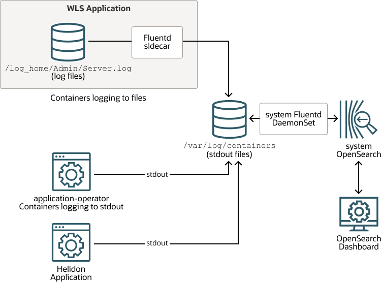

The Verrazzano logging stack consists of Fluentd, Elasticsearch, and Kibana components.

* Fluentd: a log aggregator that collects, processes, and formats logs from Kubernetes clusters.
* Elasticsearch: a scalable search and analytics engine for storing Kubernetes logs.
* Kibana: a visualization layer that provides a user interface to query and visualize collected logs.

As shown in the following diagram, logs written to stdout by a container running on Kubernetes are picked up by the kubelet service running on that node and written to `/var/log/containers`.




## Fluentd sidecar
For components with multiple log streams or that cannot log to stdout, Verrazzano deploys a Fluentd sidecar which parses and translates the log stream.  The resulting log is sent to stdout of the sidecar container and then written to `/var/log/containers` by the kubelet service.

For example, in a WebLogic deployment, `AdminServer.log` is consumed, translated, and written to stdout by the Fluentd sidecar.  You can view these logs using `kubectl` on the container named `fluentd-stdout-sidecar`.
 ```shell
$ kubectl logs tododomain-adminserver \
    -n todo-list \
    -c fluentd-stdout-sidecar
```

## Fluentd DaemonSet
Verrazzano deploys a Fluentd DaemonSet which runs one Fluentd replica per node in the `verrazzano-system` namespace.
Each instance pulls logs from the node's `/var/log/containers` directory and writes them to the target Elasticsearch index.  The index name is based on the namespace associated with the record, using this format: `verrazzano-namespace-<record namespace>`.

For example, `vmi-system-kibana` logs written to `/var/log/containers` will be pulled by Fluentd and written to Elasticsearch.  The index used is named `verrazzano-namespace-verrazzano-system` because the VMI runs in the `verrazzano-system` namespace.

The same approach is used for both system and application logs.
## Elasticsearch
Verrazzano creates an Elasticsearch deployment as the store and search engine for the logs processed by Fluentd.  Records written by Fluentd can be queried using the Elasticsearch REST API.

For example, you can use `curl` to get all of the Elasticsearch indexes. First, you must get the password for the `verrazzano` user and the host for the Elasticsearch VMI.
```shell
$ PASS=$(kubectl get secret \
    --namespace verrazzano-system verrazzano \
    -o jsonpath={.data.password} | base64 \
    --decode; echo)
$ HOST=$(kubectl get ingress \
    -n verrazzano-system vmi-system-es-ingest \
    -o jsonpath={.spec.rules[0].host})

$ curl -ik \
   --user verrazzano:$PASS https://$HOST//_cat/indices "\n"
```

To see all of the records for a specific index, do the following:
```shell
$ INDEX=verrazzano-namespace-todo-list

$ curl -ik \
    --user verrazzano:$PASS https://$HOST/$INDEX/_doc/_search?q=message:* "\n"
```

Verrazzano provides support for [Installation Profiles](). The production profile (`prod`), which is the default, provides a 3-node Elasticsearch and persistent storage for the Verrazzano Monitoring Instance (VMI). The development profile (`dev`) provides a single node Elasticsearch and no persistent storage for the VMI. The `managed-cluster` profile does not install Elasticsearch or Kibana in the local cluster; all logs are forwarded to the admin cluster's Elasticsearch instance.

## Kibana
Kibana is a visualization dashboard for the content indexed on an Elasticsearch cluster.  Verrazzano creates a Kibana deployment to provide a user interface for querying and visualizing the log data collected in Elasticsearch.

To access the Kibana console, read [Access Verrazzano]().

To see the records of an Elasticsearch index through Kibana, create an index pattern to filter for records under the desired index.  

For example, to see the log records of a WebLogic application deployed to the `todo-list` namespace, create an index pattern of `verrazzano-namespace-todo-list`.


