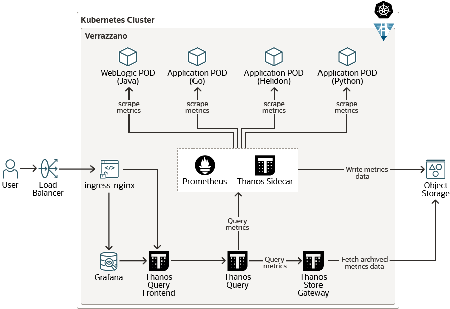
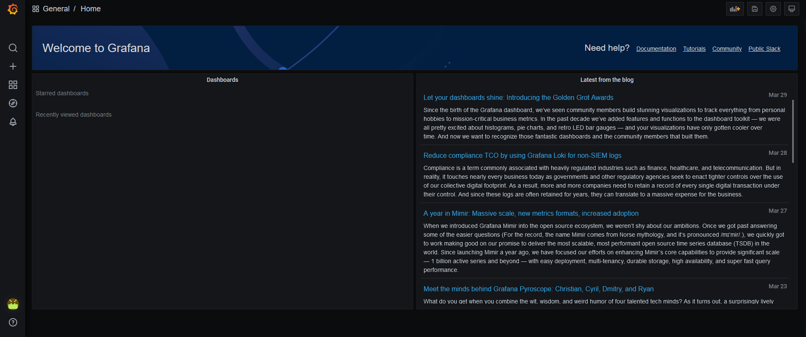

## Overview

The Verrazzano metrics stack automates metrics aggregation and consists of Prometheus and Grafana components.
Metrics sources expose system and application metrics.
The Prometheus components retrieve and store the metrics and Grafana provides dashboards to 
visualize your metrics.



### Metrics sources

Metrics sources produce metrics and expose them to the Kubernetes Prometheus system using annotations in the pods. 
The following is an example of the Prometheus related configuration specified in the `todo-list` application pod:

`kubectl describe pod tododomain-adminserver -n todo-list`

```
Annotations:  prometheus.io/path: /wls-exporter/metrics
              prometheus.io/port: 7001
              prometheus.io/scrape: true
```

To look directly at the metrics that are being made available by the metric source, map the port and then access the path.
For example, for the previous metric source:

`kubectl port-forward tododomain-adminserver 7001:7001 -n todo-list`

`curl - u USERNAME:PASSWORD localhost:7001/wls-exporter/metrics`

### Metrics scraper

- Single pod per cluster
- Named `prometheus-*` in `istio-system` namespace
- Discovers exposed metrics endpoints
- Stores the scraped metrics in memory

### Metrics pusher

- Single pod per cluster
- Named `prom-pusher-system-*` in `monitoring` namespace
- Pulls metrics from the Metrics Scraper
- Pushes metrics to the Metrics Gateway

### Metrics gateway

- Single pod per cluster
- Named `vmi-system-prometheus-gw-*` in `verrazzano-system` namespace

### Metrics server

- Single pod per cluster
- Named `vmi-system-prometheus-*` in `verrazzano-system` namespace
- Pulls metrics from the Metrics Gateway
- Responsible for exposing all metrics

## Grafana

Grafana provides visualization for your Prometheus metric data.

- Single pod per cluster
- Named `vmi-system-grafana-*` in `verrazzano-system` namespace
- Provides dashboards for metrics visualization

To access Grafana

- Get the hostname from the Grafana ingress

`kubectl get ingress vmi-system-grafana -n verrazzano-system`

```
NAME                 CLASS    HOSTS                                             ADDRESS         PORTS     AGE
vmi-system-grafana   <none>   grafana.vmi.system.default.152.70.134.91.nip.io   152.70.134.91   80, 443   26h
```

- Get the password for the user `verrazzano`

`kubectl get secret --namespace verrazzano-system verrazzano -o jsonpath={.data.password} | base64 --decode; echo`
- Access Grafana in a browser using the above hostname 
- Log in using the `verrazzano` user and the above password




From here you can select an existing dashboard or create a new dashboard.
To select an existing dashboard, click the dashboard dropdown list at the top left of the page. 
The initial value of this list is `Home`.


To view host level metrics select the `Host Metrics` dashboard. This will provide system metrics for all
of the nodes in your cluster.


To view the application metrics for the `todo-list` demo application select the `WebLogic Server Dashboard` dashboard 
as the `todo-list` application is a WebLogic application.


