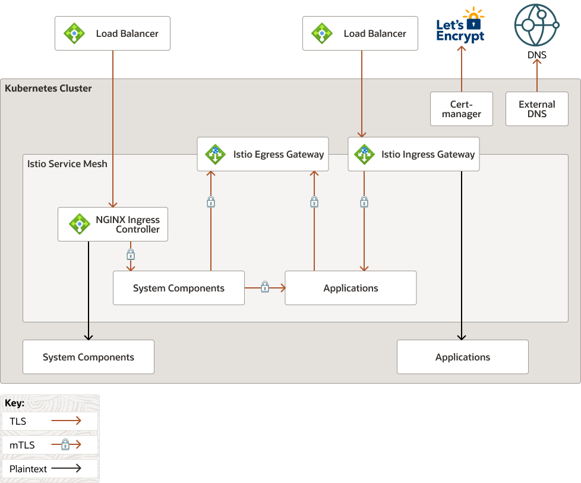

A Verrazzano instance is comprised of both Verrazzano components and several 
third party products. Collectively, these components are called the Verrazzano 
system components.  In addition, after Verrazzano is installed, 
a Verrazzano instance can include applications deployed by the user.  Applications 
can also be referred to as components, not to be confused with OAM `components`.  

All of the system components and applications use the network to some degree.  Verrazzano 
configures networking to provide network security and traffic management.  Network 
settings are configured both at installation and during runtime as applications as are 
deployed into the Kubernetes cluster.

### High-Level Overview
The following diagram shows the high-level overview of Verrazzano networking 
using ExternalDNS and Let's Encrypt for certificates. ExternalDNS and cert-manager 
both run outside the mesh and connect to external services using TLS.  This diagram 
does not show Prometheus scraping. 

Verrazzano system traffic enters a platform load balancer over TLS and is routed to the
NGINX Ingress Controller, where TLS is terminated.  From there, the traffic is routed
to one of the system components in the mesh over mTLS, or using HTTP to a system component,
outside the mesh.  

Application traffic enters a second OCI load balancer over TLS and is routed to the
Istio Ingress Gateway, where TLS is terminated. From there, the traffic is routed 
to one of several applications using mTLS.

***NOTE***: Applications can be deployed outside the mesh, but the Istio Ingress Gateway
will send traffic to them using plaintext.  You need to do some additional configuration to 
enable TLS passthrough as described at [Istio Gateway Passthrough](https://istio.io/latest/docs/tasks/traffic-management/ingress/ingress-sni-passthrough/)

#### High-Level Network Diagram

### Platform Network Connectivity
A Kubernetes cluster is installed on some platform, such as Oracle OKE,
an on-premise installation, a hybrid cloud topology, and such.  Verrazzano only interfaces
with Kubernetes; it has no knowledge of platform topology or network security.  It is
your responsibility to ensure that there is network connectivity.  For example, the
ingresses might use a platform load balancer which will provide the entry point into the
cluster for Verrazzano consoles and applications.  These load balancer IPs must be
accessible for your users.  Also, in the multicluster case, clusters might be on
different platform technologies with firewalls between them. Again, you need to 
ensure that the two clusters have network connectivity.

### Network configuration during installation
A summary of the network-related configuration follows.

Verrazzano does the following as it relates to networking:
1. Installs and configures NGINX Ingress Controller.
1. Creates Ingress resources for system components.
1. Installs and configures Istio.
1. Enables strict mTLS for the mesh by creating an Istio PeerAuthentication resource.
1. Creates an Istio egress gateway service.
1. Creates an Istio ingress gateway service.
1. Configures several Verrazzano system components to be in the mesh.  
1. Optionally, installs ExternalDNS and creates DNS records.
1. Creates certificates required by TLS used by system components.
1. Creates certificates required by Kubernetes API server to call webhook.
1. Creates NetworkPolicies for all of the system components.

### Network configuration during application lifecycle
Verrazzano does the following as it relates to applications being deployed and terminated:
1. Optionally, creates an Istio Gateway and VirtualService resources.
1. Creates Istio AuthorizationPolicies as needed.
1. Creates Istio DestinationRules as needed.
1. Optionally, creates a self-signed certificate for the application.
1. Optionally, creates DNS records using ExternalDNS.
